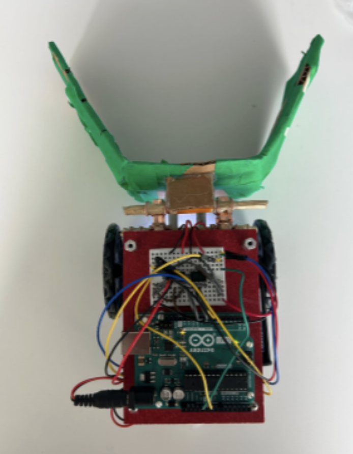
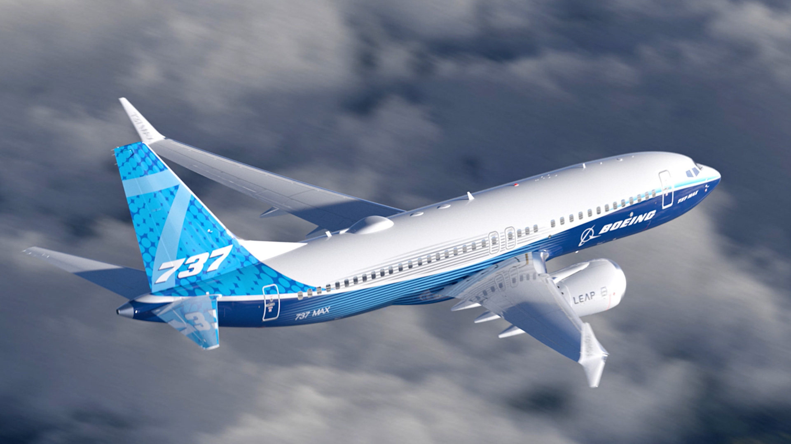

## About Me

<iframe src="https://drive.google.com/file/d/1aHTx99DMBE7vandcKv1oCWEwGulrrBrG/preview" width="30%" height="200px" style="border:none;"></iframe>

My name is Alex Jenkins,

I am a current junior attending Cornell University studying Mechanical Engineering. I love experimenting with how different systems interplay with each other, as well as pursuing robotics, automobiles, and aerospace. I was the co-lead of the Sportsman subteam at Combat Robotics @ Cornell and now serve as the new member training lead. I love the competition aspect of the team, as well as the community and teamwork that is implemented in build sessions.

Some non-technical things about me: I love to read, I'm an F1 fan, and I've been a sailing instructor at Cornell University since my freshman spring (2023). I love being outdoors and on the water, and I enjoy meeting new people and sharing my love of sailing with them.

---

## 📄 View My Resume

<iframe src="https://drive.google.com/file/d/17bkGMamfIFcSDadu5ZBGtZHH0vn5d37J/preview" width="75%" height="600px" style="border:none;"></iframe>

---

## 🤖 View My Mechatronics Final Project

## MAE 4272 Final Wind turbine Project

## MAE 4300 Boeing 737 Max

---

## 🌐 External Portfolio Link

Since embedding Google Sites is blocked, click below to view the full version of my external portfolio:

[🔗 View Full Portfolio](https://sites.google.com/cornell.edu/alex-jenkins-portfolio/home)

